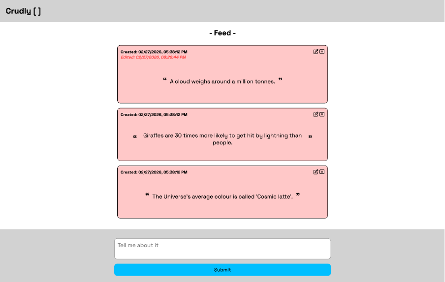

# Crudly

A full-stack CRUD application for creating, reading, editing, and deleting posts in a simple social feed.



## Tech Stack

**Frontend:** HTML, CSS, Vanilla JavaScript (ES6 modules)

**Backend:** Python, FastAPI, Pydantic, AWS DynamoDB (via boto3)

Backend is structured as a model-controller-service-repository package (`api/`).

## Features

- View a feed of posts fetched from DynamoDB via the API
- Create new posts with auto-generated UUIDs and timestamps
- Edit posts inline (click away to save)
- Delete posts from the feed and database
- All CRUD operations persist to DynamoDB — DOM updates only after server confirmation

## Getting Started

### Prerequisites

- Python 3
- AWS account with DynamoDB
- AWS credentials configured locally

### Install dependencies

```bash
python3 -m venv venv
source venv/bin/activate
pip install -r requirements.txt
```

### Configure environment

Create a `.env` file in the project root (excluded from git):

```
# DynamoDB settings
DB_TABLE=Posts
DB_REGION=ap-southeast-2
```

Update `config.js` with your backend URL:

```js
export const BASE_URL = "http://127.0.0.1:8000/";
```

### Seed the database (optional)

```bash
python seed.py
```

### Run the backend

```bash
fastapi dev api/controller.py
```

### Run the frontend

Open `index.html` in a browser, or serve it locally:

```bash
python -m http.server 8080
```

Then visit `http://localhost:8080`.

## API Endpoints

| Method | Route   | Description         |
| ------ | ------- | ------------------- |
| GET    | `/`     | Get all posts       |
| POST   | `/`     | Create a new post   |
| PUT    | `/{id}` | Update a post by ID |
| DELETE | `/{id}` | Delete a post by ID |

\*README generated using Claude CLI
